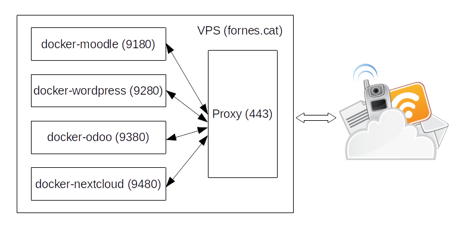

= CFGS-DAW M8
Octavi Fornés <octavi@fornes.cat>
:doctype: article
:encoding: utf-8
:lang: ca
:toc: left
:toclevels: 3
:numbered:

== Introducció

Aquest document es divideix en tres parts:

1. Descripció de la pràctica, enunciat i tasques a resoldre
2. Anàlisi i presa de decisions
3. Descripció de les solucions

== Descripció de la pràctica

=== Enunciat
Un centre educatiu de la comarca del Baix Camp es veu amb la necessitat d'externalitzar tota la seva infraestructura de serveis informàtics.

Actualment aquesta infraestructura consta de varis servidors físics que formen un clúster, on hi ha tota una sèrie de servidors virtualitzats. Aquests servidors virtuals aporten el serveis necessaris que requereix el centre pel seu funcionament diari. De serveis n'hi ha molts, i destaquen els que resolen les següents necessitats:

- Pàgina corporativa del centre (pàgina web amb WordPress)
- CMS educatiu (Moodle en aquest cas)
- Repositori d'arxius (disc dur en xarxa)
- ERP Gestió de centre i relació amb les famílies (Odoo)

El coordinador informàtic del centre ha donat llum verda a la prova pilot d'externalització d'aquests 4 serveis en un VDS extern al centre.

El fet de voler tenir contractat un VDS respecte als servidors físics que actualment hi ha al centre és per estalviar costos d'infraestructures: aire acondicionat pel CPD, manteniment dels equips, manteniment del SAI, etc.

El coordinador informàtic et demana una implementació d'aquests serveis, sense necessitat de dades reals, però sí que estiguin tots desplegats.

=== Tasques a resoldre

L'aspirant ha de proposar, mostrar i defensar una solució a la problemàtica plantejada en l'enunciat.

S'ha de documentar o penjar els arxius de configuració necessaris en un repositori públic de control de versions com per exemple GitHub, GitLab, Bitbucket, etc.

També ha de ser capaç de respondre les preguntes formulades al voltant de la implementació proposada, i altres preguntes tècniques d'un caràcter semblant a:

- Quina creus que és la millor forma de tenir tots aquests serveis en un únic VDS?
- Plantejaries una alternativa a la idea del coordinador informàtic?
- Si s'acabés implementant l'externalització com ho faries per moure les dades del clúster actual fins al nou VDS.

== Anàlisi i presa de decisions

Per decidir per la solució final, he dividit l'anàlisi en quatre parts:
- Solució per hostatjar (VDS vs VPS)
- Proveïdor de servei
- Implementació de serveis
- Procés de migració

=== Solució per hostatjar

Primer de tot recordem la diferència entre VDS i VPS:

- VDS _**V**irtual **D**edicated **S**erver_ és una solució consistent en oferir una màquina dedicada amb virtualització per a obtenir diferents servidors
- VPS _**V**irtual **P**rivate **S**erver_ és la solució que consisteix en disposar d'un servidor virtual en una màquina física compartida.

La diferència primordial és que amb VDS dispossem d'una màquina física per a nosaltres sols, mentre que amb VPS no.

Però en ambdós casos, dispossarem de la capacitat de disposar d'un o més servidors virtuals per a allotjar els serveis que necessitem.

He establert els següents criteris per a triar la solució final. Cada ítem es valora en una escala del 0 a 2, sent el zero el més baix i dos el més alt.

- Cost econòmic
- Capacitats d'ús
- Facilitat de manteniment
- Escalabilitat

==== VDS

Les ofertes de VDS són molt diverses, https://ovh.com, https://goddady.com, etc. Però totes coincideixen en que el preu és molt elevat.

Els VDS permeten crear tants servidors virtuals com capacitat tingui el hardware, per tant, limitat.

En aquest cas, a més del manteniment dels servidors virtuals, també s'ha de fer manteniment del host. En alguns casos es pot delegar, però també incrementa el cost.

VDS no ofereix més escalabilitat que la d'augmentar memòria o disc, [underline]##però sempre limitat a les capacitats del hardware contractat##. També es pot canviar a disc de tipus NVMe sinó l'haviem contractat. El que no he trobat és la creació de clústers de servidors dedicats.

==== VPS

Les ofertes VPS són molt més diverses. De fet hi ha proveïdors que no ofereixen VDS però sí VPS (com ara https://digitalocean.com). En tots els casos, el preu és molt més baix que en el cas del VDS.

Un VPS no permet crear més d'un servidor virtual, però sí que admeten l'ús d'eines de virtualització de sistema operatiu, com ara Docker. Això ens permet adaptar l'ús d'un sol servidor virtual al desplegament d'un _clúster_ de màquines docker operant dins el mateix servidor virtual.

El manteniment del VPS no requereix del manteniment del host físic. En aquest aspecte només requereix del mateix manteniment que els servidors virtuals del VDS: actualitzacions, antivirus, protecció DDoS, etc.

VPS ofereix les mateixes opcions d'escalabilitat que ofereix el VDS: disc, memòria, etc. però sense les limitacions del hardware físic.

==== Altres opcions: cloud-computing

A més de les dues opcions anteriors, també s'ha estudiat la opció més _de moda_ dels darrers temps, la de cloud-computing.

Aquesta opció és més semblant a la VPS, ja que no s'ofereix hardware físic, sinó nodes d'un clúster.

De fet, el que permet és contractar per separat, elements de computació, elements d'emmagatzematge i orquestració.

El sistema d'orquestració permet -de manera automàtica- _replicar_ nodes amb un servei concret (per exemple una aplicació web), de manera que si augmenta el nombre de peticions en un moment donat, el servei d'orquestració és capaç d'escalar la solució de manera que l'aplicació web suporti amb èxit la demanda.

En qualsevol cas, aquest tipus de solució no s'aplicaria al nostre cas, ja que la capacitat d'un VDS o un VPS és més que suficient per a poder afrontar amb èxit la operativa diària.

==== Comparativa final

Tot seguit una taula que m'ha servit per la decisió
.Comparativa VDS - VPS
[width="100%",cols=">1h,^1,^1,2",options="header,footer"]
|====================
| Item | VDS | VPS | Observacions 
| Cost econòmic | 1 | 2 | Tot i la varietat de preus, VDS és més car en una proporció de 10 a 1 aproximadament
| Capacitats d'ús | 2 | 1 | El VDS permet crear més d'un servidor virtual, amb la qual cosa, podem disposar de més _espais de servidor_ que en el cas de VPS. Tot i així, en el VPS podem utilitzar docker, amb la qual cosa podem compondre una solució al VPS semblant a la del VDS
| Facilitat de manteniment | 1 | 2 | En el cas del VDS s'ha de fer una manteniment extra, el del hardware. En el cas del VPS només el del servidor virtual, igual que els servidors virtuals del VDS
| Escalabilitat | 1 | 2 | El cas del VDS està limitat a la capacitat del hardware, mentre que en el cas del VPS es pot escalar sense aquesta limitació
| Total | *5* | *7*| La màxima puntuació és per al *VPS*
|====================

==== Aplicació de disc en xarxa

S'han analitzat diverses opcions, totes elles _opensource_. Els criteris de selecció han estat:

1. Opensource
2. Sólid i madur
3. Amb client per a escriptori i mòbil
4. Senzill d'utilitzar i administrar

Desprès de diverses recerques, les tres opcions més adients són:

* OwnCloud
* NextCloud
* Syncthing

De totes elles, la més senzilla, ja que només ofereix aquesta funcionalitat, és _Syncthing_. El problema és que aquesta eina manté actualitzats (descarregats) tots els arxius compartits, la qual cosa fa que si a la unitat hi ha molta informació, qualsevol client amb poc espai de disc tindria problemes. Per tant, es descarta directament.

Les dues alternatives restants, no descarreguen els arxius al client, sinó que -al igual que Dropbox- només descarreguen les metadades. Només descarreguen el contingut si s'intenta accedir-hi.

Qualsevol de les dues és acceptable, per anteriors experiencies he triat NextCloud.

=== Estructura de desplegament de les aplicacions

Donat que la solució és VPS i tot pensant en un futur en _cloud_, les aplicacions s'estructuraran amb una solució *Docker*, de manera que amb arxius de configuració podem desplegar totes les solucions.

Per a construir la solució s'ha emprat la eina _docker-compose_, amb un arxius `docker-compose.yml`.

Les aplicacions només seran visibles en local, per a accedir-hi s'ha habilitat un proxy que redirigeix en funció del nom de subdomini. 

==== Pràctica de migració de dades de serveis

Per a demostrar la solució de la migració de dades s'han creat dos entorns _moodle_:

- ant-moodleweb (representa que és l'actual)
- new-moodleweb (representa que és el nou)

El desplegament deixa l'anterior totalment operatiu (amb dos cursos importats) i el nou amb només una pàgina de cortesia per indicar que s'està en procés de migració.

La resolució de com fer la migració es descriu al capítol <<Procés de migració>>

==== Domini de proves

S'ha utilitzat el domini de proves:

- fornes.cat

Tot creat subdominis per a cadascuna de les aplicacions:

.Relació de proves i dominis
[width="100%",cols=">1h,^1",options="header,footer"]
|====================
| Prova | Subdomini
| migració moodle-web anterior | https://moodleant-daw8.fornes.cat
| migració moodle-web nou | https://moodlenew-daw8.fornes.cat
| wordpress | https://wordpress-daw8.fornes.cat
| odoo | https://odoo-daw8.fornes.cat
| nextcloud | https://nextcloud-daw8.fornes.cat
| moodle | https://moodle-daw8.fornes.cat
|====================

Internament s'utilitza el proxy-reverse d'apache per a poder _connectar_ els dominis amb els servidors aixecats amb docker.

== Descripció de les solucions

Com s'ha explicat a <<Estructura de desplegament de les aplicacions>>, s'utilitzaran contenidors dockers amb cada aplicació. Davant d'aquests contenidors s'hi instal·larà un proxy amb _apache_ que actuarà entre les crides d'internets i els corresponents servidors interns.

La imatge següent il·lustra la solució:

=== Procés de migració

El procés de migració es demostra amb els contenidors _dockers_ següents:

* ant-moodleweb i postgresdbant
* new-moodleweb i postgresdb

El primer representa el moodle anterior, amb la seva pròpia base de dades.

El segon representa el nou moodle, també amb la seva pròpia base de dades.

El procés de migració es simula tot accedint a la màquina antiga:

[source,bash]
----
docker compose exec ant-moodleweb bash
----

I desprès només cal llençar l'escript que fa la còpia:

[source,bash]
----
do-backup.sh $(pwd -P)
----

D'aquesta manera es copien tots els elements necessaris:

* Directori de codi (`/var/www/html`)
* Directori de _dades_ (`/var/www/moodledata`)
* Base de dades

I desprès es comprimeix tot en un sol arxius comprimit.

El procés següent és copiar aquest arxiu a la nova màquina:

[source,bash]
----
scp -i /root/moodle-key 2022*.tgz moodle@new-moodleweb:
----

I ara hem d'anar a la nova màquina a restaurar:

[source,bash]
----
docker compose exec new-moodleweb bash
----

== Referències

=== Directoris del host i relació amb volums dels dockers

.Relació de directoris del host amb volums dels dockers
[width="100%",cols=">1,^1,1,2",options="header,footer"]
|====================
| Path host | servei docker | volum docker | observacions
| /var/local/volumes/mysql-data | dbmysql | /var/lib/mysql | Taules del servidor mysql
| /var/local/volumes/wordpress-data | moodle | 
| /var/local/volumes/moodle-data | moodle | Part de data
| /var/local/volumes/moodle-code | moodle | Part de codi
| /var/local/volumes/nextcloud | nextcloud | Web
| /var/local/volumes/odoo | odoo | Web
|====================

=== Usuaris i passwords

Els usuaris i passwords de databases s'especifiquen a l'arxiu encriptat link:webs/secure.env.gpg[secure.env.gpg]. És necessari la clau d'encriptat segura.

=== Relació de dominis

.Relació de proves, dominis i ports interns
[width="100%",cols=">2h,^2,1",options="header,footer"]
|====================
| Prova | Subdomini | Port intern
| migració moodle-web anterior | https://moodleant-daw8.fornes.cat | 8280
| migració moodle-web nou | https://moodlenew-daw8.fornes.cat | 8180 
| wordpress | https://wordpress-daw8.fornes.cat | 9280 
| odoo | https://odoo-daw8.fornes.cat | 9380 
| nextcloud | https://nextcloud-daw8.fornes.cat | 9480 
| moodle | https://moodle-daw8.fornes.cat | 9180
|====================